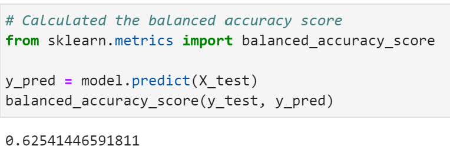
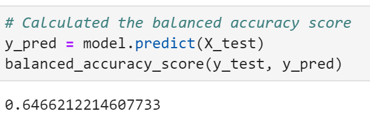

# Credit_Risk_Analysis
Applying data preparation, statistical reasoning and machine learning skills to solve a real-world challenge: credit card risk.

# Overview of the loan prediction risk analysis:
## The purpose of this analysis :
Fast lending, a peer to peer lending services company wants to use machine learning to predict credit risk and in order to have a more accurate identification of good candidates of loans which will lead to lower default rates.

Credit risk is an inherently unbalanced classification problem, as good loans easily outnumber risky loans. Therefore, we'll employ different techniques to train and evaluate models with unbalanced classes using imbalanced-learn and scikit-learn libraries to build and evaluate models using resampling.

Using the credit card credit dataset from LendingClub, a peer-to-peer lending services company, we've oversampled the data using the RandomOverSampler and SMOTE algorithms and undersampled the data using the ClusterCentroids algorithm. Then, used a combinatorial approach of over- and undersampling using the SMOTEENN algorithm. Next, compared two new machine learning models that reduce bias, BalancedRandomForestClassifier and EasyEnsembleClassifier, to predict credit risk. Once done, evaluate the performance of these models and make a written recommendation on whether they should be used to predict credit risk.

### Tools used : 
Running codes in a jupyter notebook using python and importing the relevant libraries.

### Resources : 
We are using LoanStats_2019Q1.csv as the resource file for the following Modules.

# Results :

## Credit Risk Resampling Techniques
Oversampled the data using the RandomOverSampler and SMOTE algorithms, undersampled the data using the ClusterCentroids algorithm and combinatorial approach of over- and undersampling using the SMOTEENN algorithm.

Split the Data into Training and Testing

The y or target column is "loan_status", in which the results are in the form of "high_risk" and "low_risk"

    The count of the y values is as follows:
        low_risk     68470
        high_risk      347

The X value has other relevant columns.

### a) Naive Random Oversampling :
We imported balanced_accuracy_score from sklearn.metrics. 
a. Balanced Accuracy Score : 

The balanced accuracy score is 0.64.

b. Confusion Matrix : The confusion matrix is as follows :

c. Classification Report : The classification report is as follows :

### b) SMOTE Oversampling :
a. Balanced Accuracy Score : 

The balanced accuracy score is 0.65.

b. Confusion Matrix : The confusion matrix is as follows :

c. Classification Report : The classification report is as follows :

### c) Undersampling
a. Balanced Accuracy Score : 

The balanced accuracy score is 0.51.

b. Confusion Matrix : The confusion matrix is as follows :

c. Classification Report : The classification report is as follows :

### d) Combination (Over and Under) Sampling
a. Balanced Accuracy Score : 

The balanced accuracy score is 0.51.

b. Confusion Matrix : The confusion matrix is as follows :

c. Classification Report : The classification report is as follows :

## 2. Ensemble Learners
In this section, two ensemble algorithms are compared to determine which algorithm results in the best performance. Trained a Balanced Random Forest Classifier and an Easy Ensemble AdaBoost classifier . For each algorithm, completed the following steps:

Trained the model using the training data.
Calculated the balanced accuracy score from sklearn.metrics.
Printed the confusion matrix from sklearn.metrics.
Generated a classication report using the imbalanced_classification_report from imbalanced-learn.

Note: Used a random state of 1 for each algorithm to ensure consistency between tests

### a) Balanced Random Forest Classifier
For the Balanced Random Forest Classifier only, printed the feature importance sorted in descending order (most important feature to least important) along with the feature score.

a. Balanced Accuracy Score : 

The balanced accuracy score is 0.91.

b. Confusion Matrix : The confusion matrix is as follows :

c. Classification Report : The classification report is as follows :

Also, we sorted the feature importance in descending order.

### b) Easy Ensemble AdaBoost Classifier
a. Balanced Accuracy Score : 

The balanced accuracy score is 0.94.

b. Confusion Matrix : The confusion matrix is as follows :

c. Classification Report : The classification report is as follows :

Summary:

Below the comparison of all the 6 models we used for the predictions :

As we tried new models here, we saw that the predictions started getting better. And as the high risk category is more important in case of credit risk, we want to focus on the scores for the high risk category. 

As per the above image we see that the ensemble learners model showed a better recall as well as f1-scores for the high risk. But the scores were still not the best to consider that model as the best model.

There is a recommendation on which model to use, or there is no recommendation with a justification (3 pt)

The Easy Ensemble model showed the highest accuracy score of 0.94, as well as the highest recall score of 0.67 of the high risk category but failed score well at the f1-score at only 0.07 for the same. This proves that though the Easy Ensemble model looks the best as compared to the other tried models here but its still not the final recommended model here.
